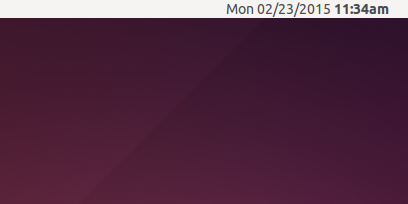

# ClockIndicator
[](https://codeclimate.com/github/jcmuller/clock_indicator)
[](https://codeclimate.com/github/jcmuller/clock_indicator)
[](https://gemnasium.com/jcmuller/clock_indicator)

## Motivation

I started using [i3](https://i3wm.org/) recently, and one thing I was
missing was having a full clock on the status bar (I am using
[trayer](://code.google.com/p/trayer/)). Ubuntu's Unity one just
wouldn't work. So, I set out to writing one.



## Features
  * Clock updates every five second
  * Context menu
  * On click, a row of monthly calendars is shown, with the current
  month in the middle

## TODO
  * Add preferences to select the format of the date displayed
  * Add preferences for number of calendars shown
  * Figure out how to have calendars window show up in the same screen

## Installation

Get https://github.com/PaulSD/Tray_Apps/tree/master/gtktrayicon
```bash
$ sudo apt-get install libgirepository1.0-dev gobject-introspection libgtk-3-dev
$ sudo make install

$ gem install clock_indicator
```

## Usage

    $ clock_indicator

## Contributing

1. Fork it ( https://github.com/jcmuller/clock_indicator/fork )
2. Create your feature branch (`git checkout -b my-new-feature`)
3. Commit your changes (`git commit -am 'Add some feature'`)
4. Push to the branch (`git push origin my-new-feature`)
5. Create a new Pull Request
